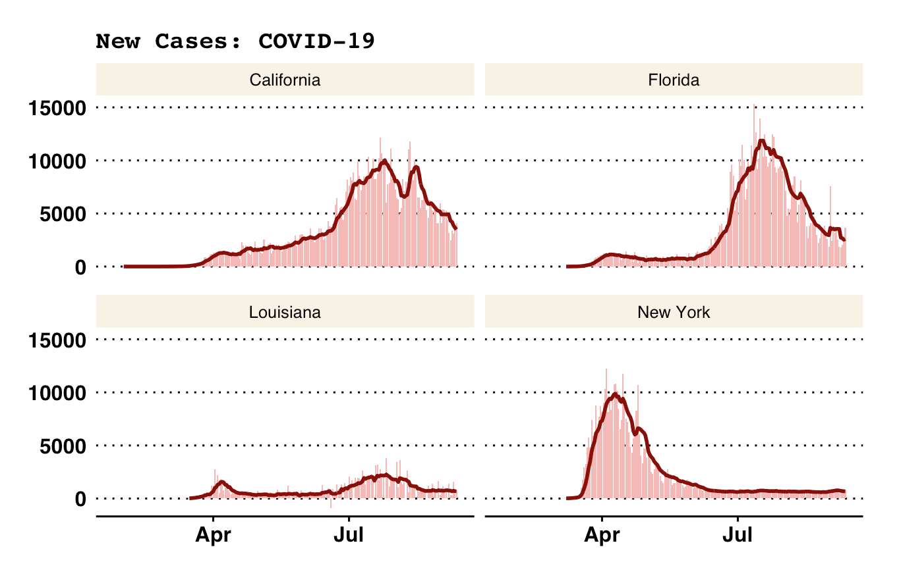
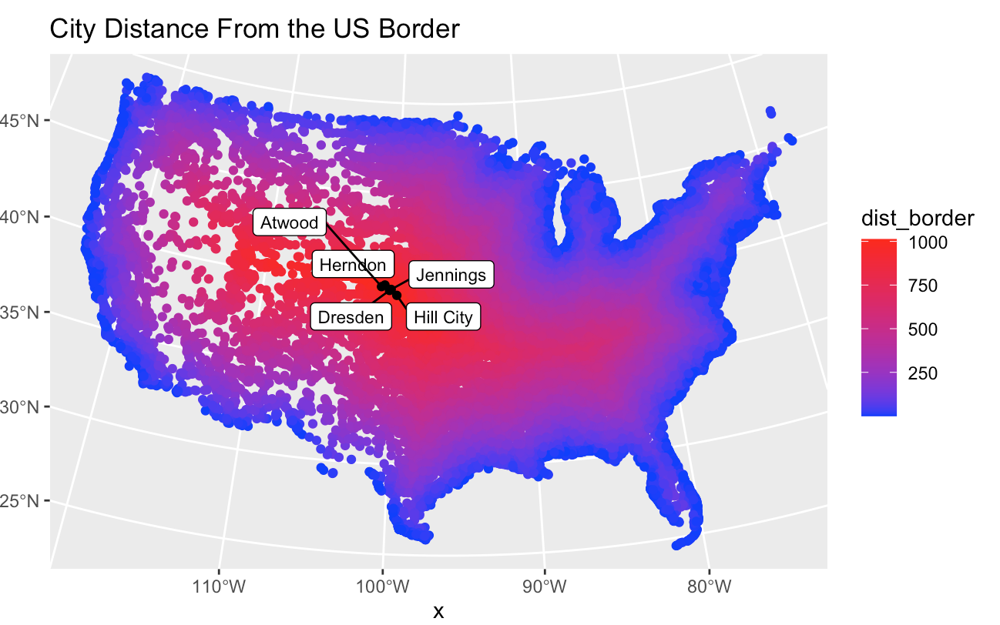
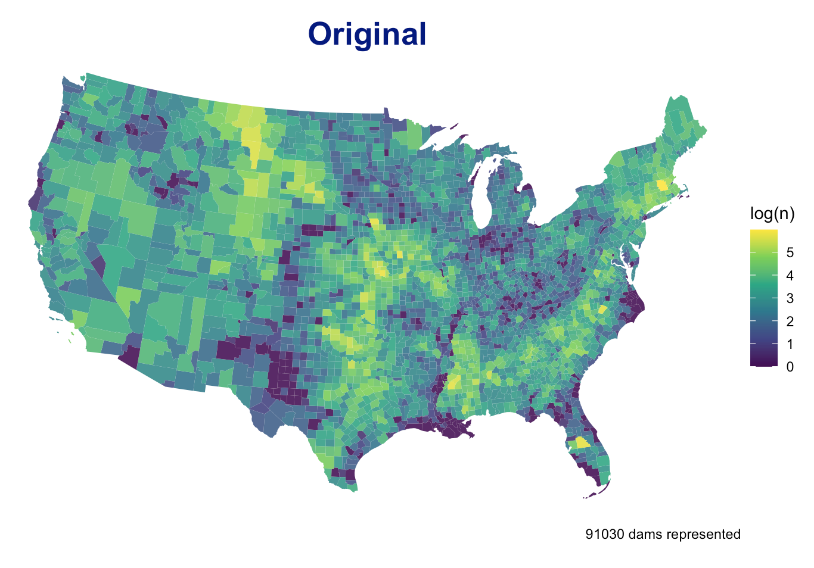
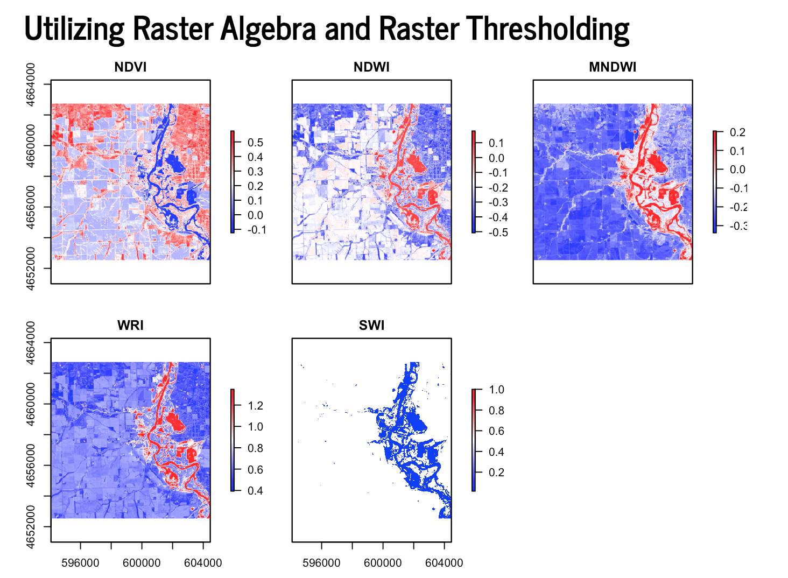
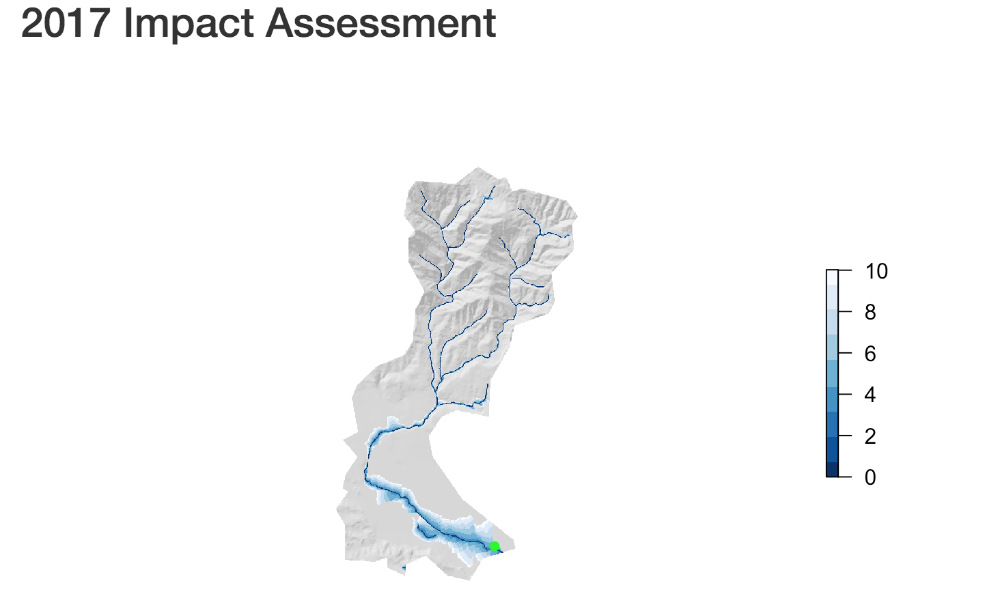

In the summer of 2020 I took a class GIS course based in R. I wrote some code, and did some cool data science. Here is a collection of links! 

## [Building a project website]()

- In this assignment we built a static users site with Github Pages 
- Includes a github repo for access to all the code.
- Familiarized myself with publishing on Github by "committing" and then "pushing" files
- Been exposed to markdown, YMAL, CSS, HTML and website construction
- Learned how to render site and add icons

## [Data Wrangling with COVID-19 Data](https://amykou43.github.io/geog-176A-labs/lab-02.html)

- Practiced data wrangling and visualization skills using real-time COVID-19 data maintained by the New York Times
- Learned how to make tables with knitr::kable and read in data with read_csv
- Learned how to join two data sets
- Learned how to plot graphs with ggplot

## [Projections, Distances, and Mapping ](https://amykou43.github.io/geog-176A-labs/lab-03.html)

- Explored the properties of sf, sfc, and sfg features & objects
- Calculated the distances of US cities to various US borders
- Used ggrepel to make labels in ggplot graph

## [Tesselations, Spatial Joins, and Point-in-Polygon](https://amykou43.github.io/geog-176A-labs/lab-04.html)

- Explored the impacts of tessellated surfaces and the modifiable areal unit problem (MAUP) using the National Dam Inventory 
- Used tessellations to analyze dam data across the United States
- Used function to summarize tesellated surfaces
- Made a leaflet map representing the largest, at risk, flood control dams in each state

## [Raster Analysis](https://amykou43.github.io/geog-176A-labs/lab-05.html)

- Worked with multiband raster files to detect and analyze a flood event near Palo, Iowa
- Used the raster package to create flood images using mutliband Landsat Imagery, thresholding, and classification methods
- Calculated the kmeans to determine the accuracy of the binary raster layers

## [Terrain Analysis](https://amykou43.github.io/geog-176A-labs/lab-06.html)

- Visualized Santa Barbara Basin and Mission Creek River System
- Used Terrain Analysis to create Elevation, Hillshade, and Height Above Nearest Drainage (HAND) rasters
- 2017 Flood impact assessment to see impacted buildings 

